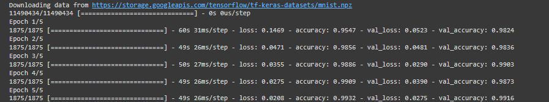
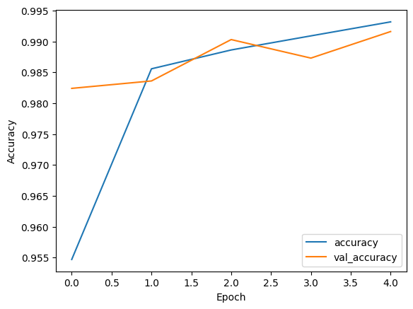
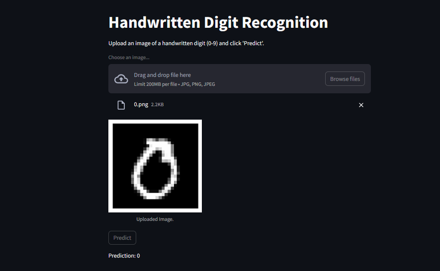
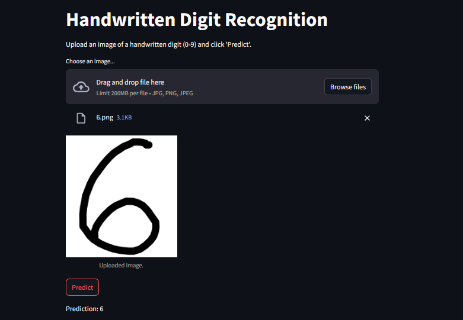

# Handwritten Digit Recognition using Convolutional Neural Networks

This project implements a Convolutional Neural Network (CNN) to recognize handwritten digits using the MNIST dataset. The CNN is built using TensorFlow's Keras API.

## Dataset
The MNIST dataset is used for training and testing the model. It consists of 28x28 grayscale images of handwritten digits (0-9).

## Requirements
- TensorFlow
- Matplotlib
- Python 3.x

## Usage
1. Run the provided Python script (`handwritten_digit_recognition.py`).
2. The script will automatically download and preprocess the MNIST dataset.
3. The CNN model will be constructed and trained on the training data.
4. Training and validation accuracy will be plotted over epochs.
5. The model will be evaluated on the test set, and the test accuracy will be printed.
6. Finally, predictions will be made on a few test images, and the predicted labels along with the true labels will be displayed.

## Model Architecture
- Input Layer: Accepts 28x28 grayscale images.
- Convolutional Layers: Consist of multiple convolutional and max-pooling layers to extract features from the input images.
- Flatten Layer: Flattens the output from the convolutional layers into a one-dimensional vector.
- Fully Connected Layers: Consist of one or more densely connected (fully connected) layers.
- Output Layer: Produces the final classification probabilities for each digit class using the softmax activation function.
#Accuracy
  
#Graph
  
#Predictions

## Results
- The model achieves a high accuracy on the test set, demonstrating its effectiveness in recognizing handwritten digits.

